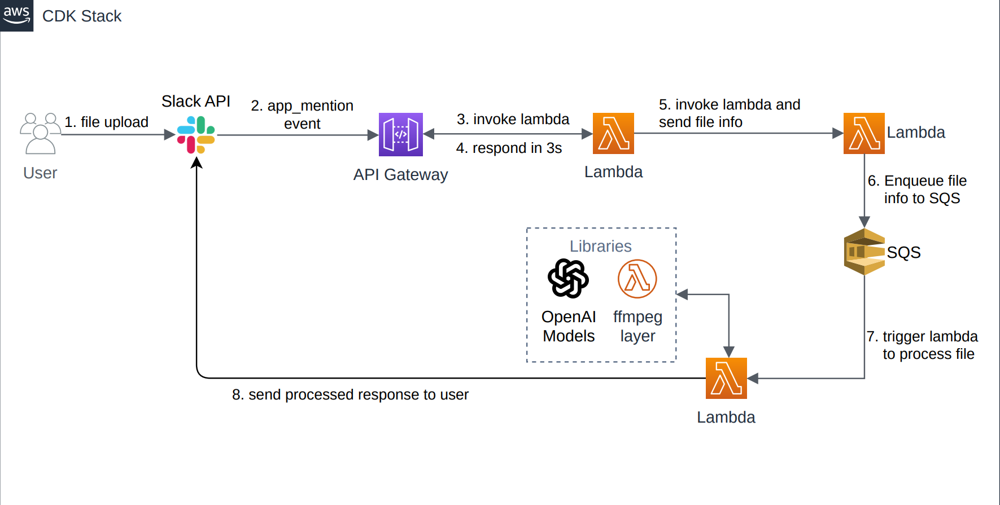

# Meeting Summarizer

## Overview
`meeting_summarizer` is an automated system designed to handle Slack events, process uploaded files or messages, and interact with Slack users through a bot. The system leverages AWS services including Lambda, API Gateway, SQS, and SSM to create an efficient, serverless processing pipeline.

## Architecture
The project integrates various AWS services with Slack to automate file and message processing. 



## Project Structure
The project is organized into two main directories: `infrastructure` and `lambda_functions`.

### Infrastructure
Contains the AWS CDK definitions for setting up the infrastructure. It includes:

- `api_gateway.py`: Sets up the API Gateway.
- `lambda_functions.py`: Defines the AWS Lambda functions.
- `permissions.py`: Manages IAM roles and permissions.
- `queues.py`: Configures the SQS queues.
- `ssm_parameters.py`: Manages SSM parameters for secure storage of configuration and secrets.

### Lambda Functions
Contains the code for Lambda functions and their specific dependencies:

- `payload_handler`: Quick response Lambda to acknowledge Slack events.
- `push_to_sqs_handler`: Handles file information retrieval and pushes messages to SQS.
- `slack_bot_handler`: Processes the Slack events and interacts with Slack API.
  - `handlers/slack_handler.py`: Main handler for Slack events.
  - `services/`: Contains service modules like `summarizer_services.py`, `transcription_services.py`, and `youtube_service.py`.
  - `utils/`: Utility modules like `slack_utils.py` and `ssm_utils.py`.

- `lambda_layers/ffmpeg_layer`: Contains the ffmpeg binaries used for media processing.

## Setup and Deployment
1. **Prerequisites:**
   - AWS CLI installed and configured.
   - Node.js and AWS CDK installed.
   - Slack API tokens and necessary permissions.
   - Setup SSM Parameters using following commands:
      ```bash
      aws ssm put-parameter --name "/meeting_summarizer/openai_api_key" --value <openai_api_key> --type SecureString

      aws ssm put-parameter --name "/meeting_summarizer/slack_bot_token" --value <slack_bot_token> --type SecureString

      export INPUT_QUEUE_NAME=<SQSQueueName>
      aws ssm put-parameter --name "/meeting_summarizer/input_queue_name" --value <slack_bot_token> --type SecureString

      # command to check the parameters
      aws ssm get-parameters-by-path --path "/meeting_summarizer" --query 'Parameters[*].Name'
      ```

2. **Clone the Repository:**
  - Clone the repository using following command:
    ```
    git clone [repository URL]
    cd meeting_summarizer
    ```

3. **Install Dependencies:**
  - Navigate to each lambda function directory and install dependencies (using a virtual environment is recommended):
    ```bash
    python3 -m venv .venv
    source .venv/bin/activate # on mac
    source .venv\Scripts\activate # on windows
    pip install -r requirements.txt
    ```

4. **Deploy with AWS CDK:**
  - From the root directory, deploy the infrastructure using CDK:
    ```
    cdk deploy
    ```

5. **Configure Slack App:**
- Set up event subscriptions and bot permissions in your Slack app configuration.

6. **Verify Deployment:**
- Test the system by interacting with the Slack bot and checking the logs for AWS Lambda functions.

## Usage
After deployment, the Slack bot will be ready to receive events. Users can interact with the bot by mentioning bot along with uploading files or sending youtube url directly to it. The bot will process the received content and respond with the summary of media file.